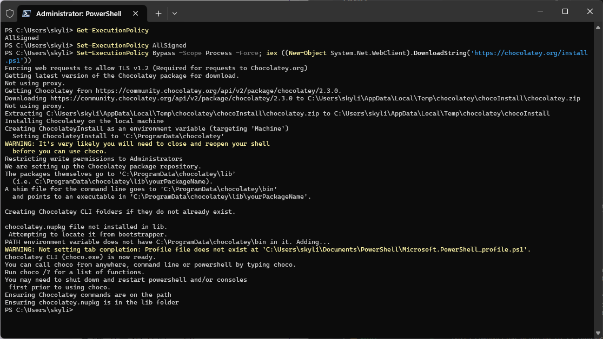

# My Personal Java Start up
## references
- [The Will Will Web](https://blog.miniasp.com/post/2021/08/04/Developing-Java-Spring-Boot-in-Visual-Studio-Code)
## ENV SETUP
### Install Chocolatey
1. Window + X

2. Open Powershell (Administrator)

3. 
```Powershell
PS C:\Users\skyli> Get-ExecutionPolicy
AllSigned
PS C:\Users\skyli> Set-ExecutionPolicy AllSigned
PS C:\Users\skyli> Set-ExecutionPolicy Bypass -Scope Process -Force; iex ((New-Object System.Net.WebClient).DownloadString('https://chocolatey.org/install.ps1'))
Forcing web requests to allow TLS v1.2 (Required for requests to Chocolatey.org)
Getting latest version of the Chocolatey package for download.
Not using proxy.
Getting Chocolatey from https://community.chocolatey.org/api/v2/package/chocolatey/2.3.0.
Downloading https://community.chocolatey.org/api/v2/package/chocolatey/2.3.0 to C:\Users\skyli\AppData\Local\Temp\chocolatey\chocoInstall\chocolatey.zip
Not using proxy.
Extracting C:\Users\skyli\AppData\Local\Temp\chocolatey\chocoInstall\chocolatey.zip to C:\Users\skyli\AppData\Local\Temp\chocolatey\chocoInstall
Installing Chocolatey on the local machine
Creating ChocolateyInstall as an environment variable (targeting 'Machine')
  Setting ChocolateyInstall to 'C:\ProgramData\chocolatey'
WARNING: It's very likely you will need to close and reopen your shell
  before you can use choco.
Restricting write permissions to Administrators
We are setting up the Chocolatey package repository.
The packages themselves go to 'C:\ProgramData\chocolatey\lib'
  (i.e. C:\ProgramData\chocolatey\lib\yourPackageName).
A shim file for the command line goes to 'C:\ProgramData\chocolatey\bin'
  and points to an executable in 'C:\ProgramData\chocolatey\lib\yourPackageName'.

Creating Chocolatey CLI folders if they do not already exist.

chocolatey.nupkg file not installed in lib.
 Attempting to locate it from bootstrapper.
PATH environment variable does not have C:\ProgramData\chocolatey\bin in it. Adding...
WARNING: Not setting tab completion: Profile file does not exist at 'C:\Users\skyli\Documents\PowerShell\Microsoft.PowerShell_profile.ps1'.
Chocolatey CLI (choco.exe) is now ready.
You can call choco from anywhere, command line or powershell by typing choco.
Run choco /? for a list of functions.
You may need to shut down and restart powershell and/or consoles
 first prior to using choco.
Ensuring Chocolatey commands are on the path
Ensuring chocolatey.nupkg is in the lib folder
```


4. Check Chocolatey
```powershell
PS C:\Users\skyli> choco
Chocolatey v2.3.0
Please run 'choco -?' or 'choco <command> -?' for help menu.
```

5. install extension pack
Search all the version 
```powershell
choco search
```
|Pack|Code|
|:-:|:-:|
|notepad++|choco install notepadplusplus.install|

### Install Java
extension package
環境變數
### Install Maven
環境變數
### Install Spring Boot
extension package
### Install PostgreSql
環境變數